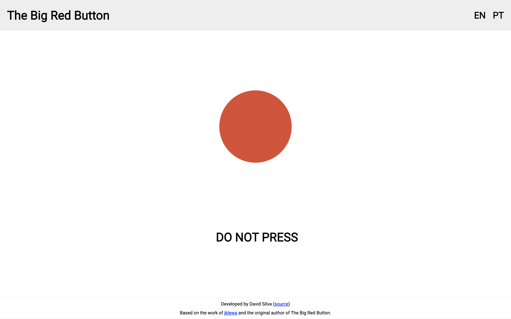

# The Big Red Button _in Angular_

The Big Red Button is a text-based "adventure" (let's call it like that) initially developed by an unknown author
in Adobe Flash. Several translations and adaptations of this project existed back in its original days (2008? 2010? I'm not sure).

[jklewa](https://github.com/jklewa/big-red-button) went through every frame of the BigRedButton.swf
the same way everyone else did and copied everything over as accurately as they could from Flash to JavaScript.

The objective of this project is to adapt the code to support new devices with new screen sizes and follow new web standards to keep The Big Red Button alive
and translated into several languages.

The website may not be displayed correctly in all screen resolutions.

## Development server

Run `ng serve` for a dev server. Navigate to `http://localhost:4200/`. The app will automatically reload if you change any of the source files.

## Code scaffolding

Run `ng generate component component-name` to generate a new component. You can also use `ng generate directive|pipe|service|class|guard|interface|enum|module`.

## Build

Run `ng build` to build the project. The build artifacts will be stored in the `dist/` directory. Use the `--prod` flag for a production build.

## Running unit tests

Run `ng test` to execute the unit tests via [Karma](https://karma-runner.github.io).

## Running end-to-end tests

Run `ng e2e` to execute the end-to-end tests via [Protractor](http://www.protractortest.org/).

## Further help

To get more help on the Angular CLI use `ng help` or go check out the [Angular CLI Overview and Command Reference](https://angular.io/cli) page.
